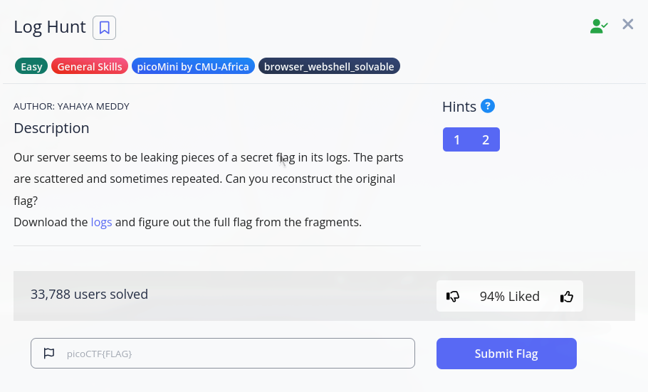

# Picoctf Log_hunt

For this [ctf](https://play.picoctf.org/practice/challenge/527?originalEvent=77&page=1) we have been provided with a log file containing a substantial ammount of log data so i started off by simply doing `❯ cat server.log` i had a quick look at the first line which was `[1990-08-09 10:00:10] INFO FLAGPART: picoCTF{us3_` it prompted me to think maybe the flag had another _ as i had not seen an underscore anywhere else in the logs so i did `❯ cat server.log | grep _` which then returned

```
[1990-08-09 10:00:10] INFO FLAGPART: picoCTF{us3_
[1990-08-09 10:02:55] INFO FLAGPART: y0urlinux_
[1990-08-09 10:05:54] INFO FLAGPART: sk1lls_
[1990-08-09 10:05:55] INFO FLAGPART: sk1lls_
[1990-08-09 11:04:27] INFO FLAGPART: picoCTF{us3_
[1990-08-09 11:04:29] INFO FLAGPART: picoCTF{us3_
[1990-08-09 11:04:37] INFO FLAGPART: picoCTF{us3_
[1990-08-09 11:09:16] INFO FLAGPART: y0urlinux_
[1990-08-09 11:09:19] INFO FLAGPART: y0urlinux_
[1990-08-09 11:12:40] INFO FLAGPART: sk1lls_
[1990-08-09 11:12:45] INFO FLAGPART: sk1lls_
[1990-08-09 12:19:23] INFO FLAGPART: picoCTF{us3_
[1990-08-09 12:19:29] INFO FLAGPART: picoCTF{us3_
[1990-08-09 12:19:32] INFO FLAGPART: picoCTF{us3_
[1990-08-09 12:23:43] INFO FLAGPART: y0urlinux_
[1990-08-09 12:23:45] INFO FLAGPART: y0urlinux_
[1990-08-09 12:23:53] INFO FLAGPART: y0urlinux_
[1990-08-09 12:25:32] INFO FLAGPART: sk1lls_
```

from here i was able to combine parts of the flag using the result from `grep _` resulting in ```picoCTF{us3_y0urlinux_sk1lls_``` i knew the flag would end on a bracket so i searched for ```❯ cat server.log | grep }``` which in return gave ```[1990-08-09 10:10:54] INFO FLAGPART: cedfa5fb}``` providing us with the last of the flag <details> <summary>Click to reveal the flag</summary>picoCTF{us3_y0urlinux_sk1lls_cedfa5fb}</details>


