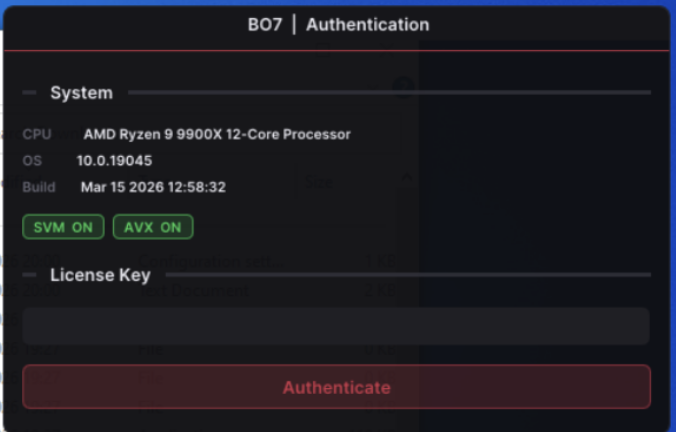
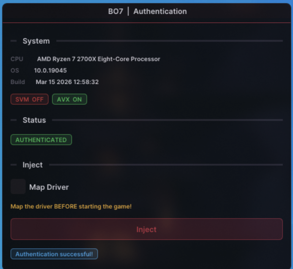

# Why did I make this?

To start off with how I came across this project and why?

I was reasonably bored, a friend had recently sent over a lot of "niche software" for me to have a look at. A lot of it was malware, but there was 1 thing that caught my attention, something called "protected.exe". I had no clue what it was so I was pretty careful, at first I tried running it in a plain fresh Windows 10 VM, and just nothing. So I started looking at it a bit closer, long story short I spent a bit looking through it in Ghidra, found out why it did not run. It was what I had suspected, 'anti VM'. So I set up a second more hidden VM, made it look realistic, spoofed BIOS, SSD name and so on, and just like that I got it to run.

So what is it?

 

Upon first glance at it and reading the title "bo7 │ Authentication" which immediately makes me think, something for a game? A mod?

It intrigued me a bit and I was interested in looking at that auth, so I treated it like a crackme found in the wild.

Just some quick info, it was obfuscated with "Themida/Winlicense 3.XX", made in C.

It was using an auth called "KeyAuth" which I found out upon a search was open source, so my mind instantly went to, can I emulate it? Short answer, Yes.

## KeyAuth 1.3 Emulator

I will start breaking everything down here in detail, how I emulated it, what problems occurred, what solutions I came up with

So at first I started off making a very basic emulator in Flask, just handling giving a success response upon a request to it. Pretty straightforward.

### Emulator

Now I wanted to try it, test it, so how did I forward the license check directly to my server? At first I started off with just modifying the "hosts" file, setting up a simple redirect. However, that caused quite a few issues such as "Curl Error: Curl ssl error" or "invalid signature", "signature verification failed". At first I was thinking some sort of Themida check or custom, it prompted me to think of other ways to redirect the license check to my server. I started thinking about other ways to redirect it without relying on the hosts file, so I made a DNS interceptor that would listen for the domain keyauth.xx and resolve it, replying with my IP, basically pointing it directly to my emulator.

And it kind of worked, I successfully forwarded its requests to my emulator, but I was still getting "signature verification failed". I noticed before it would prompt the error, it would try to send a request to KeyAuth's "/init" endpoint. I thought, what is the purpose of that call and does it affect the primary goal of emulating the auth? The answer was no, I just forwarded that request directly to KeyAuth's real server while still listening for the license check. And now we are redirecting requests to our server and the application is running, however my simple emulator did not just work seeing as they were using KeyAuth version 1.3, the latest version, which comes with a few hurdles for us. I will go over them 1 by 1.

### Problems and Solutions

KeyAuth 1.3 signs all its responses using Ed25519, and the client verifies each response against a public key hardcoded in the binary. So simply returning a "success" JSON response from my emulator wasn't going to cut it — the client would verify the signature and reject it. This meant I needed to solve 2 things, my emulator would need to sign its own responses with my own Ed25519 keypair, then I would need to get the client to actually trust those signatures. Since the public key was hardcoded in the binary, the client would need to accept my signatures unless I patched the public key in the running process to match mine.

This is where things got a bit difficult for me. How do you go about patching the public key in the running process without triggering some form of Themida detection? At first I tried with the obvious, making a DLL to patch it. Upon injection, Themida flagged it, so DLL injection was out. Next I tried a different approach, launch the process in a suspended state, patch the key before Themida's protection had a chance to initialize, then resume execution. The idea was simple — if the process isn't running yet, its integrity checks can't fire. In theory that sounds clean, but in practice it turned into a race condition. Themida's unpacking and self-protection routines run very early during process startup, so the window between "process exists in memory" and "Themida is watching" is extremely small. If you patch too early, the binary hasn't been unpacked yet and the public key isn't even in memory to find. If you patch too late, Themida's already initialized and catches it. You're essentially trying to hit a moving target — the key has to be present and Themida's integrity checks can't be active yet.

### The Solution - Frida

This is the point where Frida changed everything. Instead of trying to patch the key at the right moment during startup, fighting Themida's unpacking timeline and integrity checks, Frida let me take a completely different approach. Rather than patching the key in memory hoping that Themida wouldn't notice, I hooked the signature verification itself. The key insight was I didn't actually need to patch the key in memory, I just needed to intercept the moment the binary called its Ed25519 verification and swap it in with our public key at the point of use. Frida lets you attach to a running process and hook specific functions at runtime, so I could let Themida fully unpack, let all integrity checks finish and settle, and then attach. By the time my Frida script was doing anything, Themida had already finished all its routine scans and wasn't doing anything anymore.

The hook itself was pretty straightforward. I found the function responsible for verifying the signature, and the moment it was called, I replaced the public key argument with my own.

### TLS/HTTPS Handling

There was another hurdle to deal with. The client was communicating with HTTPS. When my DNS interceptor redirected the traffic to my emulator, it was still trying to establish a TLS connection, expected a valid SSL certificate for "keyauth.xx", and my Flask server obviously didn't have one. This was what was behind the "Curl ssl error" I was seeing earlier with the hosts file approach.

The solution was to generate a self-signed SSL certificate for the KeyAuth domain and configure my Flask emulator to serve over HTTPS using it. On its own that wouldn't be enough, the client would still reject a self-signed cert because it can't be traced back to a trusted certificate authority. So I also needed to install my self-signed CA as an administrator on the VM. Once the VM trusted my CA, and my emulator was serving with a certificate signed by that CA, the TLS handshake completed cleanly. As far as the client was concerned, it was talking to a legitimate HTTPS server.

# Conclusion and Result

Now all that was left was to give it a go.

 

Auth had been successful.

One of my first writeups — I hope it’s a useful read even if some parts are a little rough.
